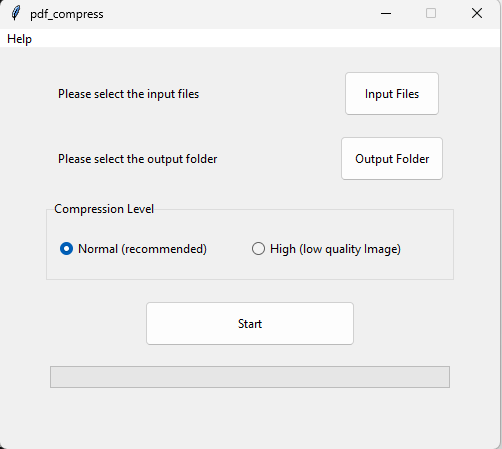

<p align="center">
  
</p>


# About
pdf_compress is a gui app for compressing single/multiple pdf file\s using Ghostscript  

made for personal use & learning purposes 

libs:  
Tkinter  

## Prerequisites  
1. Download and install Ghostscript then verify that it is working by typing gswin64 in terminal

2. Clone the repo
   ```
   git clone https://github.com/sapy22/collection_pdf_tools.git
   ```

## Usage
1. Navigate to the app folder  

2. Run the script
   ```
   py pdf_compress.py
   ```

# Reference
[link](https://victordibia.com/blog/pdf-img/)  

[link](https://github.com/Neelfrost/gs-optimize)


