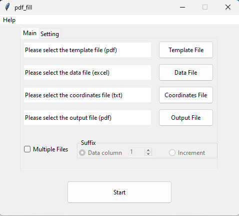

<p align="center">
  
</p>


# About
pdf_fill is a gui app for filling a template pdf with data from an excel file (used with [pdf_coordinate](https://github.com/sapy22/collection_pdf_tools))

made for personal use & learning purposes 

libs:  
Tkinter  
ReportLab  
pypdf  
openpyxl  
arabic-reshaper  
python-bidi  

## Prerequisites  
1. Clone the repo
   ```
   git clone https://github.com/sapy22/collection_pdf_tools.git
   ```

2. Change directory
   ```
   cd .\collection_pdf_tools\pdf_fill
   ```

3. Create a virtual environment
   ```
   py -m venv venv
   ```

4. Activate the venv
   ```
   .\venv\Scripts\activate
   ```

5. Install the dependencies
   ```
   pip install -r requirement.txt
   ```

## Usage
1. Navigate to the app folder  

2. Activate the venv
   ```
   .\venv\Scripts\activate
   ```

3. Run the script
   ```
   py pdf_fill.py
   ```

## Instructions
1. Data start from the 1st row
2. Make sure there is no empty column 
3. Check multiple-files if there is more then 1 data row
4. Suffix can be either form the data file (unique like id column) or an increment number (1-2-3-...) 


