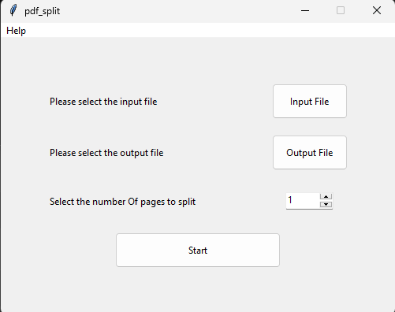

<p align="center">
  
</p>


# About
pdf_split is a gui app for splitting a pdf file  

made for personal use & learning purposes 

libs:  
Tkinter  
pypdf 

## Prerequisites  
1. Clone the repo
   ```
   git clone https://github.com/sapy22/collection_pdf_tools.git
   ```

2. Change directory
   ```
   cd .\collection_pdf_tools\pdf_split
   ```

3. Create a virtual environment
   ```
   py -m venv venv
   ```

4. Activate the venv
   ```
   .\venv\Scripts\activate
   ```

5. Install the dependencies
   ```
   pip install -r requirement.txt
   ```

## Usage
1. Navigate to the app folder  

2. Activate the venv
   ```
   .\venv\Scripts\activate
   ```

3. Run the script
   ```
   py pdf_split.py
   ```


